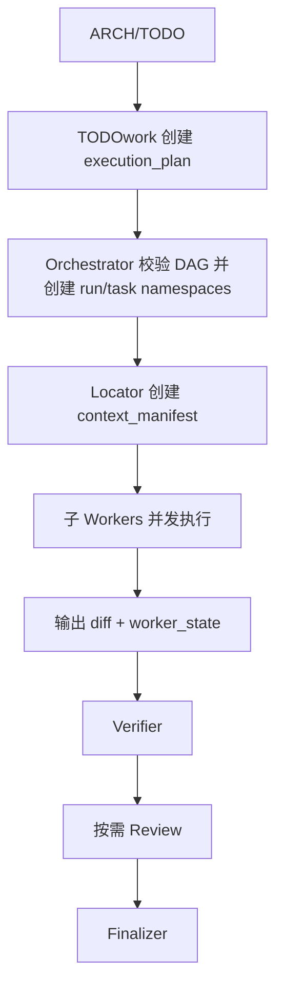

# Multi-Agent 编排协议

本协议定义 orchestrator、workers、reviewers、verifiers 和 codegraph service 如何协作。

## 1. 角色

### Orchestrator

Orchestrator 是状态机，不是自然语言转发器。

职责：

- 维护任务图
- 维护 `.adworkflow/execution_plan.json`
- 创建或批准 task specs
- 分配 workers
- 管理 run-scoped artifact registry、orchestrator revision 和 resume manifest
- 控制权限
- 路由 review findings
- 决定是否完成

除非风险升级要求，orchestrator 不应深入检查实现细节。

### Worker

Worker 拥有一个任务上下文。

职责：

- 读取 task spec
- 查询 codegraph
- 检查定向文件
- 实现变更
- 运行验证
- 修复未解决的 review findings
- 更新 worker state
- 遇到 ARCH/TODO 细节不足时上报主窗口，并在 worker_state 留痕

Review 修复应尽可能返回原始 worker 处理。

### Reviewer

Reviewer 验证 patch。

职责：

- 检查 task spec
- 检查 patch
- 检查 verification result
- 仅在需要时请求影响上下文
- 生成结构化 review findings

除非当前方案违反任务契约，否则 reviewer 不得重新设计方案。

### Verifier

Verifier 运行确定性检查。

职责：

- 运行测试
- 运行 lint/typecheck/build
- 记录命令输出摘要
- 分类失败

### Codegraph Service

Codegraph service 提供定向上下文检索。

职责：

- 定义
- 引用
- 调用方/被调用方
- 影响分析
- 测试发现
- 有边界的代码切片

## 2. 执行模式选择

### Solo Worker

默认使用。

在以下情况下选择此模式：

- 上下文共享或较微妙
- 修改触及核心流程
- 任务需要连续推理
- 编辑冲突风险较高

### Worker + Reviewer

在以下情况下选择此模式：

- 变更影响 public API
- 变更影响 auth、billing、permissions、data、concurrency、cache 或 migration logic
- patch 较大
- 测试较弱
- 用户明确请求 review

### Fan-out Workers

用于 TODOwork 生成的模块批次，或明确低耦合的子任务。

TODOwork 的逻辑任务数由模块拆分决定；运行时同时执行的 worker 数由 `worker_policy.max_parallel_workers`、平台容量和依赖共同限制。

主窗口只根据 ARCH/TODO 中的模块拆分、依赖顺序和任务边界编排 batch；不要在执行窗口额外加入业务判断。业务、产品、合规、风格等争议留给 review/final reporting。

## 3. TODOwork 并发规则

```text
TODO decides modules.
execution_plan decides batches and parallelism.
task_spec decides each worker boundary.
```

Batch 规则：

- 同一 batch 内只有通过依赖、容量和共享文件检查的 ready tasks 才能并发分配子 agent。
- 后续 batch 只等待 ARCH/TODO 明确依赖的前置 batch。
- 子 agent 只输出 diff/change summary、worker_state、必要时 verification_result。
- 子 agent 遇到未定义细节，上报主窗口；主窗口按 PRD/ARCH/TODO 复核，仍不确定时询问用户并按 timeout fallback 留痕。

## 4. 标准生命周期



## 5. 主窗口恢复

主窗口不得把压缩后的聊天摘要当成状态。恢复顺序由 `.adworkflow/runs/<run_id>/resume_manifest.json` 决定，至少重新读取 orchestrator state、execution plan、artifact registry 和活动任务 artifacts。状态更新必须携带 expected revision，防止旧窗口覆盖新状态。

## 6. Handoff 契约

每次 handoff 都应是 artifact handoff。

Worker 接收：

```text
execution_plan batch item
task_spec or task_specs/<task_id>.json
context_manifest
allowed_actions
required_outputs
```

Reviewer 接收：

```text
task_spec
patch.diff
verification_result
touched_files summary
optional impact_slice
```

Worker fix loop 接收：

```text
unresolved review_findings
patch.diff
relevant local context
latest verification_result
```

## 7. 反模式

避免：

- main agent 将 reviewer findings 改写成散文
- reviewer 充当实现者
- worker 在定位上下文前读取整个仓库
- 多个 workers 编辑同一个核心模块
- 将完整 worker 历史带入下一阶段
- 将已解决 findings 传回 fix loop
