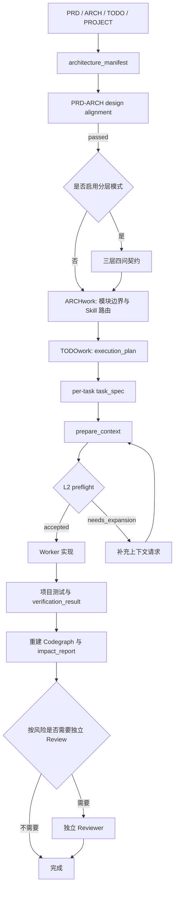

# ADworkflo

ADworkflo 是一套面向 AI 辅助软件开发的 Artifact-driven Workflow。它不替代 PRD、架构判断或工程负责人，而是把这些判断转换成可检查、可恢复、可审计的执行 artifacts，让主窗口、子 Agent、Reviewer 和验证流程围绕同一组事实工作。

它主要解决四类问题：

- 复杂任务只存在于聊天上下文，压缩或重启后容易丢失边界。
- 子 Agent 拆分后各自读取代码，重复探索，也可能因为上下文缺失而开发漂移。
- PRD、ARCH、TODO 和实际实现之间缺少显式一致性门禁。
- 修改完成后只验证“测试是否通过”，没有验证调用链、引用关系和波及范围是否符合预期。

> **平台状态**：当前仓库状态只把 Windows 作为已验证运行环境。Linux/macOS 适配器实现了标准库 `flock` 路径，但本轮没有在这些平台上运行验证。本文不会把 Linux/macOS 描述为已通过运行测试。

## 核心思路

ADworkflo 把开发过程中的事实从聊天记录移到结构化文件中：

```text
产品文档
-> 设计一致性门禁
-> 分层开发契约
-> 架构与任务编排
-> task_spec
-> 定向上下文与语义切片
-> Worker 实现
-> 验证与修改后影响分析
-> 独立 Review
-> 可恢复的完成记录
```

聊天用于沟通，artifact 才是执行和恢复依据。Agent 不应把压缩摘要、记忆中的路径或上一次回答当作代码事实。

## 两组“分层”概念

ADworkflo 中有两组不同的分层，使用时不要混淆。

### 系统职责的三层

| 层 | 主要内容 | 维护者 |
| --- | --- | --- |
| 产品设计层 | `PRD.md`、`ARCH.md`、`TODO.md`、`PROJECT.md` | 产品负责人和架构负责人 |
| 工程执行层 | `.adworkflow/`、`.codegraph/`、`.codex/` | 主窗口、脚本、Worker、Reviewer |
| 全局 Skill 层 | `skills/adworkflo/`、`skills/arch-work/`、`skills/todo-work/` | 本仓库和本机安装的 Skill |

产品设计层定义要做什么以及为什么。工程执行层记录如何拆解、读什么、由谁做、如何验证。全局 Skill 层提供可复用的方法、脚本、模板和协议。

### 完整产品的三层开发模型

当用户明确要求“使用分层开发”时，产品本身按以下三个架构维度组织：

| 产品层 | 典型内容 | 主要观察点 |
| --- | --- | --- |
| 产品表现层 `presentation` | 页面、交互、状态展示、客户端流程、可访问性 | 用户能否完成目标，状态和错误是否可见 |
| 后端协议层 `protocol` | API、DTO、认证授权、错误码、事件、服务边界 | 契约是否稳定，调用方和服务端是否一致 |
| 数据支撑层 `data` | Schema、持久化、索引、迁移、缓存、一致性、回填 | 数据是否正确、可恢复、可迁移、可审计 |

这三层不是固定的“前端做完再后端、后端做完再数据库”瀑布顺序。实际执行顺序由产品能力切片、接口契约和依赖关系决定。

### 每层必须回答的四个问题

分层开发不是只给任务加三个标签。每一层都要建立四问契约：

1. **最终目标是什么**：要产生什么可观察结果，用什么证据证明结果存在。
2. **范围和边界是什么**：允许修改哪些模块，输入输出、接口、依赖和不触碰范围是什么。
3. **哪些结果不算完成**：明确假完成、局部完成、Mock 替代、缺少迁移或缺少异常处理等反例。
4. **如何探索、由谁实现、由谁独立审计**：说明探索路径、实现负责人、独立 Reviewer 以及需要提交的验证证据。

脚本入口：

```powershell
py -3 "$env:ADWORKFLO_SKILL_ROOT\scripts\layered_development.py" --project "<PROJECT_ROOT>" --force
```

`init_adworkflow.py` 已经创建了未配置的 `layer_plan.json` 模板，因此按本文顺序首次生成正式骨架时需要 `--force`。运行前先确认现有文件仍是未配置模板；如果已经填写过真实计划，不要使用 `--force`，否则会覆盖定制内容。

脚本主要输出：

```text
.adworkflow/layer_plan.json
```

它只生成通用契约骨架，不会替项目填写 capability slices、接口、owner 或 auditor。跨层 API、事件和数据边界仍需维护到 `.adworkflow/interface_contracts.json`。跨层接口未定义、四问缺项或审计角色与实现角色没有分离时，不应进入对应模块的正式开发。

## 完整执行流程



建议的门禁顺序如下：

1. PRD 与 ARCH 通过结构检查和独立语义审查。
2. 使用分层开发时，三层四问契约和跨层接口已配置。
3. 每个执行任务都有独立 `task_spec`。
4. L2 任务的 `context_preflight.status` 必须为 `accepted`。
5. Worker 留下 `worker_state`，验证者留下 `verification_result`。
6. 修改后 L2 图重建，`impact_report` 没有未解释的意外波及。
7. 中高风险任务由独立 Reviewer 审核。

## 环境要求

当前已验证的本机运行组合是：

- Windows PowerShell。
- Python 3，通过 `py -3` 调用。
- Git。
- Node.js 和 npm，仅在项目需要 TypeScript/JavaScript L2 provider 时需要。
- Codex Skill 目录，使用 `CODEX_HOME` 和 `ADWORKFLO_SKILL_ROOT` 定位。

文档中的占位符含义：

```text
<REPO_ROOT>       本仓库根目录
<CODEX_HOME>      Codex 主目录
<PROJECT_ROOT>    要接入 ADworkflo 的业务项目根目录
<TASK_ID>         当前任务的稳定 ID
<RUN_ID>          一次多任务执行的稳定 ID
```

## 安装

在本仓库根目录执行：

```powershell
Set-Location "<REPO_ROOT>"
.\install-adworkflow.ps1 -CodexHome "<CODEX_HOME>" -SetUserEnv
```

安装脚本会复制以下 Skills：

```text
adworkflo
arch-work
todo-work
artifact-driven-development
```

并在使用 `-SetUserEnv` 时设置：

```text
CODEX_HOME
ADWORKFLO_SKILL_ROOT
```

设置用户环境变量后，重新打开 PowerShell 或 Codex 任务，再确认：

```powershell
$env:CODEX_HOME
$env:ADWORKFLO_SKILL_ROOT
```

目标目录已经存在旧版本时，安装脚本默认跳过。确认需要覆盖后使用：

```powershell
.\install-adworkflow.ps1 -CodexHome "<CODEX_HOME>" -Force -SetUserEnv
```

`-Force` 会替换已安装的 Skill 目录。不要在未确认本机自定义改动时使用。

## 快速开始

### 1. 准备产品文档

在业务项目根目录维护：

```text
PRD.md
ARCH.md
TODO.md
PROJECT.md
```

建议为 PRD requirements、架构模块和 TODO 任务使用稳定 ID。稳定 ID 是后续覆盖检查、任务关联和恢复的基础。

### 2. 初始化项目本地执行层

```powershell
py -3 "$env:ADWORKFLO_SKILL_ROOT\scripts\init_adworkflow.py" --project "<PROJECT_ROOT>"
```

初始化只生成 ADworkflo 文件，不修改业务源码。它会在根目录缺失时创建 `AGENTS.md`，并生成以下主要目录：

```text
.codex/
.adworkflow/
.codegraph/
```

常用参数：

```powershell
# 显式指定项目规模
py -3 "$env:ADWORKFLO_SKILL_ROOT\scripts\init_adworkflow.py" --project "<PROJECT_ROOT>" --mode small
py -3 "$env:ADWORKFLO_SKILL_ROOT\scripts\init_adworkflow.py" --project "<PROJECT_ROOT>" --mode medium
py -3 "$env:ADWORKFLO_SKILL_ROOT\scripts\init_adworkflow.py" --project "<PROJECT_ROOT>" --mode large

# 没有产品文档时，只按源码扫描初始化
py -3 "$env:ADWORKFLO_SKILL_ROOT\scripts\init_adworkflow.py" --project "<PROJECT_ROOT>" --skip-doc-analysis

# 覆盖脚本生成的 artifacts，但保留用户维护配置
py -3 "$env:ADWORKFLO_SKILL_ROOT\scripts\init_adworkflow.py" --project "<PROJECT_ROOT>" --force

# 明确覆盖 permissions、验证命令、module skills 等用户配置
py -3 "$env:ADWORKFLO_SKILL_ROOT\scripts\init_adworkflow.py" --project "<PROJECT_ROOT>" --force-user-config
```

`--force-user-config` 的破坏性比 `--force` 更大，只应在确认需要重置项目本地配置时使用。

初始化模板中的 `task_spec.configured=false` 和 `execution_plan.configured=false` 表示尚未形成可执行任务，不能直接 dispatch。

### 3. 补充项目事实

初始化后先检查并填写：

```text
.adworkflow/permissions.md
.adworkflow/verification_commands.md
.adworkflow/module_skills.md
.adworkflow/review_checklist.md
```

- `permissions.md` 说明 Agent 可执行、需确认和禁止执行的动作。
- `verification_commands.md` 记录项目真实可用的测试、lint、typecheck 和构建命令。
- `module_skills.md` 只登记存在重复规则或特殊约束的模块 Skill。
- `review_checklist.md` 记录当前项目的数据、安全、兼容性和回归重点。

### 4. 重新分析产品文档

产品文档在初始化后发生变化时运行：

```powershell
py -3 "$env:ADWORKFLO_SKILL_ROOT\scripts\analyze_project_plan.py" --project "<PROJECT_ROOT>" --update-profile
```

它会更新 `architecture_manifest.json` 和项目规模相关 Profile。初始化时，显式 `--mode` 优先于自动判断；`auto` 模式优先使用产品文档表达的预期复杂度，没有有效产品文档时才回退到源码数量和行数。需要注意，单独运行 `analyze_project_plan.py --update-profile` 会用当前产品文档的分析结果重写 Profile，不会保留初始化时的显式 `--mode` 覆盖，执行后应重新确认规模和上下文级别。

### 5. Design Alignment Gate：执行 PRD-ARCH 一致性门禁

先生成结构化覆盖报告：

```powershell
py -3 "$env:ADWORKFLO_SKILL_ROOT\scripts\design_alignment.py" --project "<PROJECT_ROOT>" analyze
```

当结构检查完成但独立语义审查尚未批准时，命令会保持 gate blocked，并按设计返回退出码 `2`。这表示门禁正在等待审查，不是脚本故障。当前 requirement ID 识别格式为 `FR-数字`、`NFR-数字`、`UX-数字`、`SEC-数字`、`DATA-数字` 或 `API-数字`，ARCH 应引用相同 ID。

结构检查不能代替语义判断。独立 Reviewer 应检查：

- 每个 requirement 是否在 ARCH 中有对应实现边界。
- ARCH 是否悄悄扩大或缩小 PRD 范围。
- 关键异常流、权限、数据迁移和验收条件是否丢失。
- PRD 和 ARCH 是否对同一概念使用了冲突定义。

审查完成后再记录批准：

```powershell
py -3 "$env:ADWORKFLO_SKILL_ROOT\scripts\design_alignment.py" --project "<PROJECT_ROOT>" approve-semantic-review --reviewer "<REVIEWER_ID>" --note "<REVIEW_NOTE>"
```

只有 `.adworkflow/design_alignment_report.json` 的 `gate_status` 为 `passed`，才把 ARCH 交给后续编排。

### 6. 生成分层开发契约

复杂产品采用三层开发时运行：

```powershell
py -3 "$env:ADWORKFLO_SKILL_ROOT\scripts\layered_development.py" --project "<PROJECT_ROOT>" --force
```

这里的 `--force` 只适用于替换初始化生成的未配置模板。然后由主窗口和负责人补齐 `presentation`、`protocol`、`data` 三层的 capability slices、四问内容及跨层接口。脚本生成的是契约骨架，不会替产品负责人决定真实目标、owner、独立 auditor 和边界。

### 7. 运行 ARCHwork 和 TODOwork

这两步通常通过 Codex 主窗口调用 Skill，不是要求用户手工运行某个 Python 文件。

可使用以下自然语言入口：

```text
使用 ARCHwork 读取 ARCH.md，整理 MVP 流程、模块边界和 ARCH 中明确声明的 Module Skill Plan，更新工程执行层 artifacts。
```

```text
使用 TODOwork 读取 TODO.md，生成 .adworkflow/execution_plan.json 和每个模块的 task_spec。按真实依赖编排，不按逻辑任务数量盲目并发。
```

职责边界：

```text
ARCHwork 决定架构意图如何进入执行层。
TODOwork 把模块清单转换为 execution_plan。
execution_plan 决定任务依赖和 ready 状态。
task_spec 限定单个 Worker 的目标和边界。
```

### 8. 为任务准备上下文

默认读取 `.adworkflow/task_spec.json`：

```powershell
py -3 "$env:ADWORKFLO_SKILL_ROOT\scripts\prepare_context.py" --project "<PROJECT_ROOT>"
```

明确使用 L2：

```powershell
py -3 "$env:ADWORKFLO_SKILL_ROOT\scripts\prepare_context.py" --project "<PROJECT_ROOT>" --level l2
```

使用指定任务文件：

```powershell
py -3 "$env:ADWORKFLO_SKILL_ROOT\scripts\prepare_context.py" --project "<PROJECT_ROOT>" --task "<TASK_SPEC_PATH>" --level l2
```

`--task` 只改变输入 task spec，不会自动改变输出目录。上面的命令仍写根 `.adworkflow/`；多任务 run 必须同时设置 `--raw-out`、`--manifest-out`、`--slice-out` 和 `--preflight-out`，完整命令见“多任务编排与恢复”。

主要输出：

```text
.adworkflow/context_raw.json
.adworkflow/context_manifest.json
.adworkflow/semantic_slice.json       # L2
.adworkflow/context_preflight.json    # L2
```

L2 任务只有 `context_preflight.status = accepted` 才能交给 Worker。`needs_expansion` 必须先扩展上下文，`invalid` 必须修复图、入口或任务定义，不能用聊天文字直接豁免。

### 9. 实现、验证和修改后影响检查

Worker 的输入应至少包括：

```text
task_spec
context_manifest
accepted context_preflight（L2）
项目本地权限和验证规则
```

Worker 的输出应至少包括：

```text
task-scoped patch 或 change summary
worker_state
verification_result
```

代码修改和项目原生测试完成后，L2 任务运行：

```powershell
py -3 "$env:ADWORKFLO_SKILL_ROOT\scripts\codegraph_post_edit.py" --project "<PROJECT_ROOT>" --task-id "<TASK_ID>"
```

运行前，`worker_state.changed_files` 必须准确，`TASK_ID` 必须与 accepted preflight 注册的不可变 baseline 属于同一任务。该命令重建图并生成 `impact_report.json`。出现意外波及、新增关键未解析边、传播截断或 baseline 不可信时，不应把任务标记为 `verified`。

## 可直接使用的主窗口提示词

### 初始化但不改业务代码

```text
使用 ADworkflo 初始化当前项目的工程执行层。只创建或更新根 AGENTS.md、.codex、.adworkflow、.codegraph，不修改业务代码。读取 PRD、ARCH、TODO、PROJECT，生成 architecture_manifest 和项目 Profile，并报告仍需人工填写的配置。
```

### 启用三层开发

```text
这个复杂产品使用分层开发。分别为 presentation、protocol、data 建立四问契约：最终目标和观察证据、范围边界和接口、哪些结果不算完成、探索方式与实现负责人和独立审计者。先确认跨层接口，再生成执行任务。
```

### 执行一个 L2 任务

```text
使用 ADworkflo 执行任务 <TASK_ID>。先确认 task_spec，按 L2 Codegraph 生成语义切片和 preflight。preflight 未 accepted 不得实现；切片存在缺口时提交 context_expansion_request，不允许根据猜测扩大修改范围。完成后重建图并检查 impact_report。
```

### 从上下文压缩后恢复

```text
从 .adworkflow/runs/<RUN_ID>/resume_manifest.json 恢复 ADworkflo 执行。依次核对 orchestrator_state、execution_plan、artifact_registry 和活动任务 artifacts；不要把聊天摘要当作事实来源。报告 ready、blocked、in_progress 和待验证任务后继续。
```

## Artifact 说明

项目本地 artifacts 默认位于 `.adworkflow/`。多任务 run 可以把任务副本放在 `.adworkflow/runs/<RUN_ID>/tasks/<TASK_ID>/`。

| Artifact | 用途 |
| --- | --- |
| `ADWORKFLOW_PROFILE.json` | 项目规模、上下文级别、语言和执行模式 |
| `architecture_manifest.json` | 从产品文档提取的模块、风险、平台和架构事实 |
| `design_alignment_report.json` | PRD-ARCH 覆盖关系、结构检查和独立语义审查状态 |
| `layer_plan.json` | `presentation`、`protocol`、`data` 三层四问契约 |
| `interface_contracts.json` | 跨层 API、事件、数据和所有权边界 |
| `execution_plan.json` | 逻辑任务、依赖、调度批次和并发上限；运行时状态由 `orchestrator_state.json` 保存 |
| `task_spec.json` | 当前任务的目标、非目标、验收、风险和可修改范围 |
| `task_specs/<TASK_ID>.json` | 每个逻辑任务的独立任务契约 |
| `context_raw.json` | 定向检索得到的原始候选上下文 |
| `context_manifest.json` | Worker 应先读取的文件、符号、测试和边界 |
| `semantic_slice.json` | L2 入口生成的语义代码切片及图证据 |
| `context_preflight.json` | 切片新鲜度、覆盖率、置信度和未解析边门禁 |
| `context_expansion_request.json` | Worker 对缺失上下文的结构化扩展请求 |
| `worker_state.json` | 已完成项、当前问题、下一步、保留上下文和剩余风险 |
| `verification_result.json` | 执行命令、退出码、验收覆盖和残余风险 |
| `impact_report.json` | 修改前后调用、引用、import 和文件波及差异 |
| `review_findings.json` | 独立 Reviewer 的发现、严重级别和结论 |
| `orchestrator_state.json` | run 中各任务状态、依赖、revision 和并发控制状态 |
| `resume_manifest.json` | 上下文压缩或重启后的最小恢复入口 |
| `artifact_registry.json` | run 内 artifact 路径、hash 和 orchestrator revision 索引；L2 不可变 baseline 位于任务 artifact 根下的 `baselines/` |

关键原则：

- 不用长聊天记录交接，只交接任务所需 artifacts。
- `context_raw` 是候选材料，`context_manifest` 才是工作上下文清单。
- `semantic_slice` 是静态分析证据，不是源码真相。
- `verification_result` 必须记录真实运行结果，不能只写“已测试”。
- Reviewer 默认读取 `task_spec`、patch/change summary、`verification_result`；L2 任务再加入 `context_preflight` 和 `impact_report`。

## Codegraph 级别

ADworkflo 使用最轻但足够的检索方式。

| 级别 | 适合项目 | 能力 | 典型输出 |
| --- | --- | --- | --- |
| L0 | 小项目、局部修改的选择原则 | `rg`、目录树、人工上下文清单 | `context_manifest.json` |
| L1 | 中型项目、模块较多 | 文件、符号、import、测试索引 | `.codegraph/index.json` |
| L2 | 大型项目、深调用链、高风险修改 | 定义、引用、callers/callees、impact、semantic slice | `.codegraph/l2.sqlite` |

参考阈值不是硬门槛：

- 小型：约 50 个源码文件以内或 5,000 行以内。
- 中型：约 50 到 300 个源码文件或 50,000 行以内。
- 大型：300 个以上源码文件、50,000 行以上，或存在深调用链、多服务、共享状态和高风险数据流。

选择规则：

1. 显式 `--mode small|medium|large` 是人工覆盖。
2. `auto` 模式优先读取 PRD、ARCH、TODO、PROJECT 中描述的预期规模和风险。
3. 没有有效产品文档时才按当前源码数量和行数回退判断。
4. 不支持 L2 的语言保留在 L1，并写入上下文边界，不能伪装成完整语义分析。

前三条描述 `init_adworkflow.py` 的分类行为。之后单独运行 `analyze_project_plan.py --update-profile` 会按当前产品文档重写 Profile，执行后应重新核对人工规模选择。

L0 是“最轻检索优先”的原则，不代表初始化后的自动代码任务一定不建索引。当前初始化会生成 `.codegraph/config.json`，`prepare_context.py` 在需要代码上下文时可以构建 L1 索引。

## L2 Semantic Codegraph

L2 使用项目本地、带 revision 的 SQLite 图：

```text
.codegraph/l2.sqlite
.codegraph/snapshots/<REVISION>.sqlite
```

当前第一方 provider：

- Python：标准库 `ast` 和 `symtable`。
- TypeScript/JavaScript：TypeScript Compiler API。

Python provider 不需要额外安装。TypeScript/JavaScript provider 需要在已安装 Skill 中安装 runtime：

```powershell
npm install --prefix "$env:ADWORKFLO_SKILL_ROOT\providers\typescript" --ignore-scripts
```

安装器不会分发 `node_modules`，`-Force` 升级也会移除目标 Skill 中已有的 provider runtime，因此安装或强制升级后需要重新执行这条 npm 命令。

### 构建图

```powershell
py -3 "$env:ADWORKFLO_SKILL_ROOT\scripts\build_codegraph.py" --project "<PROJECT_ROOT>" --level l1
py -3 "$env:ADWORKFLO_SKILL_ROOT\scripts\build_codegraph.py" --project "<PROJECT_ROOT>" --level l2
```

TypeScript/JavaScript 项目需要在 provider 不可用时直接失败，可加：

```powershell
py -3 "$env:ADWORKFLO_SKILL_ROOT\scripts\build_codegraph.py" --project "<PROJECT_ROOT>" --level l2 --require-typescript
```

图构建成功后查询实际 capability。没有 `l2.sqlite` 时该命令会失败；只有探测结果中列出的语言和能力才可按 L2 使用：

```powershell
py -3 "$env:ADWORKFLO_SKILL_ROOT\scripts\query_codegraph.py" --project "<PROJECT_ROOT>" --level l2 capabilities
```

### 查询定义和引用

```powershell
py -3 "$env:ADWORKFLO_SKILL_ROOT\scripts\query_codegraph.py" --project "<PROJECT_ROOT>" --level l2 find-definition --symbol "<SYMBOL>"
py -3 "$env:ADWORKFLO_SKILL_ROOT\scripts\query_codegraph.py" --project "<PROJECT_ROOT>" --level l2 find-references --symbol "<QUALIFIED_SYMBOL>"
py -3 "$env:ADWORKFLO_SKILL_ROOT\scripts\query_codegraph.py" --project "<PROJECT_ROOT>" --level l2 find-importers --target "<FILE_OR_MODULE>"
```

### 查询调用链

```powershell
py -3 "$env:ADWORKFLO_SKILL_ROOT\scripts\query_codegraph.py" --project "<PROJECT_ROOT>" --level l2 callers --symbol "<QUALIFIED_SYMBOL>"
py -3 "$env:ADWORKFLO_SKILL_ROOT\scripts\query_codegraph.py" --project "<PROJECT_ROOT>" --level l2 callees --symbol "<QUALIFIED_SYMBOL>"
```

### 计算波及范围

```powershell
py -3 "$env:ADWORKFLO_SKILL_ROOT\scripts\query_codegraph.py" --project "<PROJECT_ROOT>" --level l2 impact --target "<SYMBOL_OR_FILE>" --depth 6 --budget 2500
```

输出区分直接和传播影响，并记录预算截断、未解析边和实际 graph revision。影响分析不是测试替代品，它用于决定还需要读取哪些消费者、运行哪些测试以及是否应升级 Review。

### 按入口生成语义代码切片

```powershell
py -3 "$env:ADWORKFLO_SKILL_ROOT\scripts\query_codegraph.py" --project "<PROJECT_ROOT>" --level l2 slice --entrypoint "<QUALIFIED_SYMBOL>" --depth 6 --budget 2500 --include-callers --out "<SLICE_PATH>"
```

切片包含：

- graph revision 和源码 hash。
- provider 名称、版本和实现身份。
- 纳入的 symbols、source ranges、文件和相关测试。
- coverage、confidence、truncation 和 unresolved boundaries。
- 入口、深度、预算和扩展历史。

定义、引用、调用和 import 关系保存在图中，可通过对应查询获得；`semantic_slice.json` 不复制完整边列表。这里的“全量符号引用”是指 provider 在纳入范围内成功解析并记录的引用。反射、动态 import、运行时注册、monkey patch 和框架隐式调用可能形成未解析边。ADworkflo 的要求是把这些缺口显式暴露并阻止错误置信，而不是声称静态图包含所有运行时行为。

## 防止切片误差导致开发漂移

L2 的安全策略围绕“切片可能不完整”设计：

1. 切片绑定 graph revision、源码 hash 和 provider provenance。
2. `context_preflight` 检查图是否新鲜、入口是否唯一、关键边是否解析、覆盖率和置信度是否达标。
3. `accepted` 才能 dispatch；`needs_expansion` 先补上下文；`invalid` 先修图或任务定义。
4. Worker 遇到切片外依赖时，写 `context_expansion_request.json`，不自行猜测并扩大范围。
5. 扩展由脚本应用，并写入 `semantic_slice.expansion_history` 和 `worker_state.context_expansion_history`。
6. 修改后基于不可变 baseline 重建图，比较实际影响和任务声明的预计影响。

应用扩展请求：

```powershell
py -3 "$env:ADWORKFLO_SKILL_ROOT\scripts\apply_context_expansion.py" --project "<PROJECT_ROOT>"
```

`--allow-stale` 只适合诊断旧图。正式任务不能用它绕过 freshness 或 preflight 门禁。

## L2 并发与 SQLite 可靠性

L2 会被主窗口、多个子 Agent、preflight、impact check 和恢复流程反复调用，因此并发建图和读取采用以下约束：

- build lock 覆盖 provider 分析、源码稳定性复核、candidate 构建和发布，避免旧分析后发布。
- publish lock 区分共享读取和独占发布；复合查询固定同一 lease、SQLite connection 和 graph revision。
- 锁顺序固定为 build lock 后 publish lock，避免内部锁顺序反转。
- candidate 先通过完整性和 metadata 校验，再发布不可变 snapshot，最后原子替换 active graph。
- snapshot 或 active 发布失败时保留 last-good active，不暴露半成品 SQLite。
- 源码或 config 在分析期间变化时丢弃 candidate 并有限重试。
- 锁超时、源码持续变化和发布失败返回结构化、可重试错误，不以裸 traceback 作为正常控制流。

平台实现边界：

| 环境 | 锁实现 | 本轮状态 |
| --- | --- | --- |
| Windows | `LockFileEx` 共享/独占锁 | 已执行真实 subprocess 并发测试 |
| Linux | 标准库 `flock` 路径 | 已实现，未在 Linux 运行 |
| macOS | 标准库 `flock` 路径 | 已实现，未在 macOS 运行 |
| 跨机器或不可靠网络文件系统 | 不提供分布式锁保证 | 不在支持范围 |

这套机制保证的是同一机器、同一项目路径下遵守 ADworkflo 锁协议的进程协作，不是远程图服务，也不是分布式数据库协议。

## 主窗口、子 Agent 和 Reviewer

### 主窗口

主窗口是控制面，负责：

- 把用户意图写成 `task_spec`。
- 运行 PRD-ARCH 对齐和三层四问门禁。
- 从 ARCHwork/TODOwork 得到模块路由和 `execution_plan`。
- 准备上下文，只有 preflight 通过后才 dispatch。
- 按依赖和 `max_parallel_workers` 分派 ready tasks。
- 汇总 `worker_state`、验证证据、impact 和 Review 结论。

主窗口不需要持续持有全仓库代码上下文。它只需持有运行状态、任务边界和证据索引。

### 子 Agent

子 Agent 是任务 Worker，负责：

- 只读取 `task_spec` 和 `context_manifest` 指定的初始上下文。
- 在边界内实现，不把“顺手重构”混入当前任务。
- 上报缺失上下文、架构歧义和阻塞原因。
- 记录 `worker_state` 和自己运行过的验证。

默认使用 Solo Worker。只有任务低耦合、写集不冲突、依赖明确且能独立验证时才 fan-out。

### Reviewer

Reviewer 独立检查验收条件、回归、安全、权限、数据一致性和消费者影响。Reviewer 不默认承担第二次实现，也不能仅凭 Worker 的“完成”声明批准任务。

## 多任务编排与恢复

启动一个 run：

```powershell
py -3 "$env:ADWORKFLO_SKILL_ROOT\scripts\orchestrator.py" --project "<PROJECT_ROOT>" --run-id "<RUN_ID>" start --plan "<EXECUTION_PLAN_PATH>"
```

`start` 会创建 `.adworkflow/runs/<RUN_ID>/tasks/<TASK_ID>/`。为某个 ready task 准备 L2 上下文时，必须把输入和四类输出都指向该任务目录：

`RUN_ID` 必须匹配 `[A-Za-z0-9][A-Za-z0-9._-]*`，不能包含路径分隔符或 `..` 形式的路径跳转。

```powershell
$Project = "<PROJECT_ROOT>"
$RunId = "<RUN_ID>"
$TaskId = "<TASK_ID>"
$TaskRoot = Join-Path $Project ".adworkflow\runs\$RunId\tasks\$TaskId"

py -3 "$env:ADWORKFLO_SKILL_ROOT\scripts\prepare_context.py" `
  --project $Project `
  --task "$TaskRoot\task_spec.json" `
  --level l2 `
  --raw-out "$TaskRoot\context_raw.json" `
  --manifest-out "$TaskRoot\context_manifest.json" `
  --slice-out "$TaskRoot\semantic_slice.json" `
  --preflight-out "$TaskRoot\context_preflight.json"
```

需要扩展上下文或生成修改后影响报告时，也要绑定同一任务目录：

```powershell
py -3 "$env:ADWORKFLO_SKILL_ROOT\scripts\apply_context_expansion.py" --project $Project --task-root $TaskRoot
py -3 "$env:ADWORKFLO_SKILL_ROOT\scripts\codegraph_post_edit.py" --project $Project --task-id $TaskId --out "$TaskRoot\impact_report.json"
```

将 accepted context 写入任务目录后，用 `orchestrator_state.json` 的当前 revision 更新任务状态。每次状态更新都会增加 revision，下一次调用必须使用新值：

```powershell
py -3 "$env:ADWORKFLO_SKILL_ROOT\scripts\orchestrator.py" --project $Project --run-id $RunId update-task --task-id $TaskId --status in_progress --expected-revision "<CURRENT_REVISION>"

# Worker 完成实现后
py -3 "$env:ADWORKFLO_SKILL_ROOT\scripts\orchestrator.py" --project $Project --run-id $RunId update-task --task-id $TaskId --status implementation_complete --expected-revision "<NEXT_REVISION>"

# verification、impact 和所需 review 证据齐全后
py -3 "$env:ADWORKFLO_SKILL_ROOT\scripts\orchestrator.py" --project $Project --run-id $RunId update-task --task-id $TaskId --status verified --expected-revision "<LATEST_REVISION>"
```

项目导入包中的 `prepare-context.ps1` 没有暴露四个输出路径参数，`orchestrator.ps1` 也没有暴露 `update-task`。多任务 run 应直接调用上述 Python 命令，避免不同任务覆盖根 `.adworkflow/` 的上下文文件，并保证状态能够继续推进。

查看状态和 ready tasks：

```powershell
py -3 "$env:ADWORKFLO_SKILL_ROOT\scripts\orchestrator.py" --project "<PROJECT_ROOT>" --run-id "<RUN_ID>" status
py -3 "$env:ADWORKFLO_SKILL_ROOT\scripts\orchestrator.py" --project "<PROJECT_ROOT>" --run-id "<RUN_ID>" ready
```

上下文压缩、Codex 重启或主窗口切换后：

```powershell
py -3 "$env:ADWORKFLO_SKILL_ROOT\scripts\orchestrator.py" --project "<PROJECT_ROOT>" --run-id "<RUN_ID>" resume
```

恢复顺序固定为：

```text
resume_manifest.json
-> orchestrator_state.json
-> execution_plan.json
-> artifact_registry.json
-> 活动 task_spec
-> 活动任务的 context / worker / verification / review artifacts
```

`resume_manifest` 保存最小恢复入口和 revision，不复制长聊天历史。多次压缩后仍以磁盘 artifacts 和当前源码为事实来源。

## 项目导入包

不希望直接调用全局脚本时，可以把以下目录中的**内容**复制到业务项目根目录：

```text
ADworkflo项目导入包/copy-to-project/
```

导入包同时包含示例 `PRD.md`、`ARCH.md`、`TODO.md` 和 `PROJECT.md`。导入已有项目时必须逐文件合并，不要直接覆盖真实产品文档、权限配置或验证命令。

导入包包含项目本地模板和 PowerShell 包装器：

```text
init-adworkflow.ps1
analyze-product-docs.ps1
align-design.ps1
layered-development.ps1
build-codegraph.ps1
prepare-context.ps1
apply-context-expansion.ps1
codegraph-post-edit.ps1
orchestrator.ps1
validate-adworkflow.ps1
setup-l2-provider.ps1
```

典型用法：

```powershell
.\init-adworkflow.ps1 -Project "<PROJECT_ROOT>"
.\analyze-product-docs.ps1 -Project "<PROJECT_ROOT>"
.\align-design.ps1 -Project "<PROJECT_ROOT>"
.\layered-development.ps1 -Project "<PROJECT_ROOT>" -Force
.\build-codegraph.ps1 -Project "<PROJECT_ROOT>" -Level l2
.\prepare-context.ps1 -Project "<PROJECT_ROOT>" -Level l2
.\codegraph-post-edit.ps1 -Project "<PROJECT_ROOT>" -TaskId "<TASK_ID>"
.\validate-adworkflow.ps1 -Project "<PROJECT_ROOT>"
```

这些包装器仍依赖已安装的全局 `adworkflo` Skill。为避免设备路径差异，应显式设置 `ADWORKFLO_SKILL_ROOT` 或 `CODEX_HOME`，不要依赖脚本中的本机 fallback。

`layered-development.ps1 -Force` 同样只应用于替换初始化生成的未配置 `layer_plan.json`，不要覆盖已经维护的真实计划。

## 验证

验证某个业务项目的 artifacts：

```powershell
py -3 "$env:ADWORKFLO_SKILL_ROOT\scripts\validate_adworkflow.py" --project "<PROJECT_ROOT>"
```

验证本仓库及模板同步：

```powershell
py -3 skills/adworkflo/scripts/validate_adworkflow.py --project . --templates
py -3 skills/adworkflo/scripts/sync_templates.py --check
git diff --check
```

当前 README 对应的 Windows 验证周期包含：

- 120 项自动化测试通过。
- Windows `LockFileEx` 真实 subprocess 锁、并发 reader/writer、四 builder、失败注入和进程终止恢复通过。
- 41 个 Python 文件编译检查、TypeScript analyzer 的 Node 语法检查、156 个 JSON 文件解析和 14 个 PowerShell 文件解析通过。
- 400 模块轻量压力 fixture 中包含 404 个文件和 4,404 个符号。
- 本轮多次回归中，该 fixture 的观测上限为：建图 6.778 秒、slice 0.077 秒、preflight 1.168 秒、SQLite 3.695 MiB。
- 当前仓库真实 L2 preflight 为 accepted，修改后 impact 检查通过。

这些数字是本次 Windows 环境的回归证据，不是其他设备、其他仓库规模或 Linux/macOS 的性能承诺。400 模块 fixture 是轻量压力测试，不等同于生产 monorepo benchmark。

## 常见问题

### 找不到 `ADWORKFLO_SKILL_ROOT`

重新打开终端并检查用户环境变量。也可以在当前 PowerShell 会话中临时设置：

```powershell
$env:CODEX_HOME = "<CODEX_HOME>"
$env:ADWORKFLO_SKILL_ROOT = Join-Path $env:CODEX_HOME "skills\adworkflo"
```

### TypeScript/JavaScript capability 不存在

先安装 provider runtime，再重建图并运行 `capabilities`：

```powershell
npm install --prefix "$env:ADWORKFLO_SKILL_ROOT\providers\typescript" --ignore-scripts
py -3 "$env:ADWORKFLO_SKILL_ROOT\scripts\build_codegraph.py" --project "<PROJECT_ROOT>" --level l2 --require-typescript
```

### `context_preflight` 返回 `needs_expansion`

查看 unresolved boundaries、truncation 和建议扩展方向，填写 `context_expansion_request.json`，再运行 `apply_context_expansion.py`。不要直接开始编码。

### `context_preflight` 返回 `invalid`

常见原因是 graph stale、入口不唯一、源码 hash 不匹配、provider capability 缺失或关键边无法解析。先重建图并收窄入口；无法静态解析的运行时关系应加入人工上下文和验证计划。

### 遇到锁超时或 `source-changed-during-build`

这是可重试控制结果。确认是否有其他进程持续建图或源码生成器持续改文件，等待当前构建完成后重试。不要删除 active SQLite 来绕过锁。

### `impact_report` 出现意外波及

先确认是否漏写了预计消费者或测试，再检查真实引用、调用和 import 变化。无法解释的生产代码波及、关键未解析边或传播截断应阻止 `verified`。

### 切片没有包含我知道存在的运行时关系

把它记录为 unresolved boundary，通过扩展请求加入对应注册表、配置、框架入口和集成测试。L2 是静态证据系统，不应伪造动态调用确定性。

## 明确边界

ADworkflo 不做以下事情：

- 不替产品负责人编写或批准产品方向。
- 不保证静态 Codegraph 能解析所有运行时动态行为。
- 不用通过测试替代 PRD-ARCH 一致性和影响审查。
- 不把每个模块都封装成 Skill。
- 不默认让多个 Agent 并发修改共享状态。
- 不提供跨机器分布式锁或不可靠网络文件系统的一致性保证。
- 不把 Linux/macOS 代码路径的存在描述为已通过实机验证。
- 不把聊天摘要作为任务恢复的最终事实来源。

## 仓库结构

```text
AGENTS.md
AGENT_HEADER.md
install-adworkflow.ps1
ADworkflo项目导入包/
skills/
  adworkflo/
  arch-work/
  todo-work/
  artifact-driven-development/
schemas/
templates/
examples/
tests/
CODEGRAPH_RETRIEVAL_PROTOCOL.md
MODULE_SKILLS_GUIDE.md
MULTI_AGENT_ORCHESTRATION.md
REVIEW_AND_VERIFICATION_PROTOCOL.md
```

主要入口：

- [`skills/adworkflo/SKILL.md`](skills/adworkflo/SKILL.md)：ADworkflo 使用规则和脚本入口。
- [`skills/arch-work/SKILL.md`](skills/arch-work/SKILL.md)：ARCH 到工程执行层的转换规则。
- [`skills/todo-work/SKILL.md`](skills/todo-work/SKILL.md)：TODO 到执行计划和任务规格的转换规则。
- [`skills/artifact-driven-development/SKILL.md`](skills/artifact-driven-development/SKILL.md)：artifact 交接、Worker、Reviewer 和验证协议。
- [`CODEGRAPH_RETRIEVAL_PROTOCOL.md`](CODEGRAPH_RETRIEVAL_PROTOCOL.md)：Codegraph 检索规则。
- [`MULTI_AGENT_ORCHESTRATION.md`](MULTI_AGENT_ORCHESTRATION.md)：多 Agent 编排规则。
- [`REVIEW_AND_VERIFICATION_PROTOCOL.md`](REVIEW_AND_VERIFICATION_PROTOCOL.md)：Review 和验证门禁。

## 最小执行纪律

```text
先 task_spec，后上下文。
先 context_manifest，后实现。
L2 先 accepted preflight，后 dispatch。
缺上下文先扩展，不猜测。
修改后重建图并检查 impact。
完成必须有 verification_result。
中高风险任务必须独立 review。
压缩恢复只认 artifacts 和当前源码。
```
