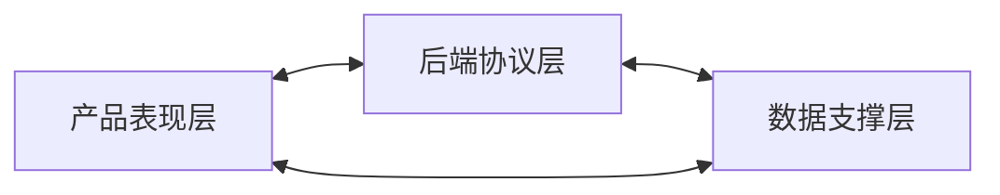
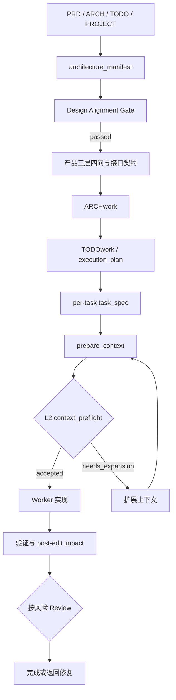

# ADworkflow

ADworkflow 是一套面向 AI 辅助开发的 Artifact-driven Workflow。它把产品意图、任务边界、代码上下文、Worker 状态、验证结果和 Review 结论写入项目文件，减少主窗口压缩、多 Agent 交接和代码检索造成的开发漂移。

> **平台状态**：当前仓库只在 Windows 上完成运行验证。Linux/macOS 已实现标准库 `flock` 锁路径，但本轮没有在这些平台或其他设备上执行运行测试。本文命令以 Windows PowerShell 为准。

## 新项目立即使用

> [!IMPORTANT]
> **唯一入口**：全局安装一次 ADworkflo Skill，每个业务项目初始化一次。不要向项目手动复制模板；后续在 Codex 中直接要求使用 `adworkflo`。

### 1. 安装或更新全局 Skill

在本仓库根目录运行：

```powershell
.\install-adworkflow.ps1 -CodexHome "<CODEX_HOME>" -SetUserEnv
```

更新已有安装时增加 `-Force`：

```powershell
.\install-adworkflow.ps1 -CodexHome "<CODEX_HOME>" -Force -SetUserEnv
```

重新打开 PowerShell 和 Codex，使 `CODEX_HOME`、`ADWORKFLO_SKILL_ROOT` 生效。TypeScript/JavaScript 项目需要 L2 Codegraph 时，再安装 provider runtime：

```powershell
npm install --prefix "$env:ADWORKFLO_SKILL_ROOT\providers\typescript" --ignore-scripts
```

### 2. 初始化业务项目

项目根目录建议先准备 `PRD.md`、`ARCH.md`、`TODO.md` 和 `PROJECT.md`。PRD 使用 `FR-1`、`UX-1`、`API-1`、`DATA-1`、`SEC-1` 等稳定需求 ID，ARCH 和 TODO 引用相同 ID。

```powershell
py -3 "$env:ADWORKFLO_SKILL_ROOT\scripts\init_adworkflow.py" --project "<PROJECT_ROOT>"
```

初始化不会修改业务代码。它会在缺失时创建 `AGENTS.md`，并生成项目本地 `.codex/`、`.adworkflow/` 和 `.codegraph/`。首次执行还要根据项目事实补齐 `permissions.md`、`verification_commands.md`、`module_skills.md` 和 `review_checklist.md`。

### 3. 在 Codex 中启动开发

在该项目的新 Codex 任务中输入：

```text
使用 adworkflo 管理这个项目。

这是一个完整产品，采用分层开发：
1. 产品表现层 presentation
2. 后端协议层 protocol
3. 数据支撑层 data

读取 PRD.md、ARCH.md、TODO.md 和 PROJECT.md，先补齐项目本地配置。
先进行 PRD-ARCH 一致性检查，并安排独立 Reviewer 完成语义审查。

然后对三层分别回答：
1. 最终目标是什么
2. 范围和边界是什么
3. 哪些结果不算完成
4. 如何探索、由谁实现、由谁独立审计

生成并完善 layer_plan、interface_contracts、execution_plan 和各模块 task_spec。
使用 ARCHwork 整理模块边界，使用 TODOwork 编排执行顺序。
门禁通过后再开始实现；完成后运行项目原生测试、post-edit impact 和独立 Review。
```

以后开发具体功能时，只需说明“使用 adworkflo 开发 `<功能>`，这是分层任务”。ADworkflo 会按 `task_spec -> 受限上下文 -> Worker -> 验证 -> 影响检查 -> Review` 执行。新项目还没有代码时从产品文档取上下文；代码出现后再建立 Codegraph。L2 任务只有 `context_preflight.status=accepted` 才能实现。

详细命令、Artifact 字段和故障处理见后文“安装”和“快速开始”。

## 先区分三个概念

### 产品架构三层：开发什么

本文中的“三层”只指产品本身的三个架构维度：

| 产品层 | 主要内容 | 完成时应观察到什么 |
| --- | --- | --- |
| 产品表现层 `presentation` | 页面、交互、客户端状态、错误反馈、可访问性 | 用户能够完成目标，成功和失败状态都可见 |
| 后端协议层 `protocol` | API、DTO、认证授权、业务状态、错误码、事件 | 调用方和服务端遵守同一契约 |
| 数据支撑层 `data` | Schema、查询、索引、迁移、事务、缓存、恢复 | 数据正确、可迁移、可恢复、可审计 |

完整产品默认按三层能力循环开发，不是固定的前端、后端、数据库瀑布。例如“用户登录”通常同时涉及页面交互、认证协议和用户或 Session 数据。纯文档任务或不涉及产品结构的局部修复可以走轻量流程，不必生成三层契约。



每层都必须回答四个问题：

1. 最终目标是什么，如何观察和验收。
2. 范围、边界、输入输出和接口是什么。
3. 哪些结果不算完成。
4. 如何探索，由谁实现，由谁独立审计，需要什么证据。

三层契约写入：

```text
.adworkflow/layer_plan.json
.adworkflow/interface_contracts.json
```

### ADworkflo 执行循环：怎么开发

ADworkflo 不是产品的第四层。它是贯穿产品三层的执行循环：

```text
四问契约
-> task_spec
-> context_manifest / semantic_slice
-> Worker 实现
-> verification_result
-> impact_report
-> 按契约或风险独立 Review
-> 下一轮能力开发
```

完整产品的表现层、协议层和数据层分别用这套循环拆解任务，并用跨层接口契约记录和核对一致性。

### Artifact 职责分区

ADworkflo 文件按职责分区，不再使用“产品设计层、工程执行层、全局工具层”这组名称：

| 职责分区 | 主要内容 | 作用 |
| --- | --- | --- |
| 需求与架构定义面 | `PRD.md`、`ARCH.md`、`TODO.md`、`PROJECT.md` | 说明做什么、为什么做、架构边界和验收要求 |
| 工程执行控制面 | `.adworkflow/`、`.codegraph/`、`.codex/` | 记录任务、上下文、状态、验证、影响和恢复入口 |
| 工作流工具底座 | `skills/adworkflo/`、ARCHwork、TODOwork | 提供脚本、模板和执行规则 |

这三个分区只描述职责和文件位置，不是产品的组成层级。

## 工作流总览



正式执行的门禁：

- PRD 与 ARCH 先通过结构检查和独立语义审查。
- 分层任务 dispatch 前，三层四问与任务涉及的跨层接口已经配置并通过检查。
- 每个 Worker 都有独立 `task_spec`。
- L2 任务只有 `context_preflight.status = accepted` 才能开始实现。
- 完成必须有 `worker_state` 和 `verification_result`。
- L2 修改后必须重建图并检查 `impact_report`。
- 中高风险任务必须由独立 Reviewer 审核。

## 安装

需要 Windows PowerShell、Python 3 和 Git。TypeScript/JavaScript L2 分析还需要 Node.js 与 npm。

占位符：

```text
<REPO_ROOT>       本仓库根目录
<CODEX_HOME>      Codex 主目录
<PROJECT_ROOT>    业务项目根目录
<TASK_ID>         稳定任务 ID
<RUN_ID>          一次多任务执行 ID
```

在本仓库根目录安装：

```powershell
Set-Location "<REPO_ROOT>"
.\install-adworkflow.ps1 -CodexHome "<CODEX_HOME>" -SetUserEnv
```

安装内容：

```text
adworkflo
arch-work
todo-work
artifact-driven-development
```

`-SetUserEnv` 会设置 `CODEX_HOME` 和 `ADWORKFLO_SKILL_ROOT`。重新打开 PowerShell 或 Codex 任务后生效。覆盖旧版本使用：

```powershell
.\install-adworkflow.ps1 -CodexHome "<CODEX_HOME>" -Force -SetUserEnv
```

`-Force` 会替换已安装 Skill，并移除 TypeScript provider 的 `node_modules`。需要 TS/JS L2 时重新安装 runtime：

```powershell
npm install --prefix "$env:ADWORKFLO_SKILL_ROOT\providers\typescript" --ignore-scripts
```

仓库不再提供复制式项目导入包。业务项目统一从已安装的全局 Skill 运行 `init_adworkflow.py`，生成项目本地 `.codex/`、`.adworkflow/` 和 `.codegraph/`。

## 快速开始

### 1. 准备文档并初始化

业务项目根目录建议包含：

```text
PRD.md
ARCH.md
TODO.md
PROJECT.md
```

PRD requirement 使用稳定 ID，例如 `FR-1`、`NFR-1`、`UX-1`、`SEC-1`、`DATA-1`、`API-1`，ARCH 引用相同 ID。

初始化工程执行控制面：

```powershell
py -3 "$env:ADWORKFLO_SKILL_ROOT\scripts\init_adworkflow.py" --project "<PROJECT_ROOT>"
```

初始化不会修改业务代码。它会在缺失时创建根 `AGENTS.md`，并生成 `.codex/`、`.adworkflow/` 和 `.codegraph/`。

常用选项：

- `--mode small|medium|large`：人工指定项目规模。
- `--skip-doc-analysis`：跳过产品文档分析，按源码扫描初始化。
- `--force`：覆盖生成型 artifacts，保留用户维护配置。
- `--force-user-config`：连同权限、验证命令和 module skills 一起覆盖，使用前必须确认。

初始化模板中的 `task_spec.configured=false` 和 `execution_plan.configured=false` 不可执行。

### 2. 补充项目事实

初始化后检查：

```text
.adworkflow/permissions.md
.adworkflow/verification_commands.md
.adworkflow/module_skills.md
.adworkflow/review_checklist.md
```

这些文件分别记录 Agent 权限、项目真实验证命令、模块 Skill 路由和 Review 风险重点。

产品文档后续发生变化时重新分析：

```powershell
py -3 "$env:ADWORKFLO_SKILL_ROOT\scripts\analyze_project_plan.py" --project "<PROJECT_ROOT>" --update-profile
```

该命令会按当前产品文档重写 Profile。执行后重新确认项目规模和上下文级别。

### 3. 通过设计门禁并建立产品三层契约

生成 PRD-ARCH 覆盖报告：

```powershell
py -3 "$env:ADWORKFLO_SKILL_ROOT\scripts\design_alignment.py" --project "<PROJECT_ROOT>" analyze
```

当结构检查完成但语义审查尚未批准时，命令返回退出码 `2`，表示 Design Alignment Gate 正在等待独立审查。Reviewer 应检查 requirement 覆盖、范围扩大、异常流、权限、数据迁移和验收条件。

审查完成后记录批准：

```powershell
py -3 "$env:ADWORKFLO_SKILL_ROOT\scripts\design_alignment.py" --project "<PROJECT_ROOT>" approve-semantic-review --reviewer "<REVIEWER_ID>" --note "<REVIEW_NOTE>"
```

完整产品通过设计门禁后，替换初始化生成的未配置骨架：

```powershell
py -3 "$env:ADWORKFLO_SKILL_ROOT\scripts\layered_development.py" --project "<PROJECT_ROOT>" --force
```

`--force` 只能用于未配置模板。已经填写真实计划时不要运行，否则会覆盖内容。脚本只生成骨架，仍需填写 capability slices、接口、实现负责人和独立 auditor。

### 4. ARCHwork、TODOwork 与任务执行

在 Codex 主窗口使用：

```text
使用 ARCHwork 读取 ARCH.md，整理 MVP 流程、模块边界和 ARCH 中声明的 Module Skill Plan。
使用 TODOwork 读取 TODO.md，生成 execution_plan 和每个模块的 task_spec，并按真实依赖编排。
```

单任务准备上下文：

```powershell
py -3 "$env:ADWORKFLO_SKILL_ROOT\scripts\prepare_context.py" --project "<PROJECT_ROOT>" --level l2
```

默认读取 `.adworkflow/task_spec.json`，输出 `context_raw.json`、`context_manifest.json`、`semantic_slice.json` 和 `context_preflight.json`。`needs_expansion` 必须先扩展，`invalid` 必须修复图、入口或任务定义。

应用扩展请求：

```powershell
py -3 "$env:ADWORKFLO_SKILL_ROOT\scripts\apply_context_expansion.py" --project "<PROJECT_ROOT>"
```

修改和项目原生测试完成后：

```powershell
py -3 "$env:ADWORKFLO_SKILL_ROOT\scripts\codegraph_post_edit.py" --project "<PROJECT_ROOT>" --task-id "<TASK_ID>"
```

`worker_state.changed_files` 必须准确，任务 ID 必须和 accepted preflight 注册的 baseline 一致。意外波及、新增生产关键未解析边、传播截断或 baseline 不可信都会阻止 `verified`。

## 主要 artifacts

| Artifact | 用途 |
| --- | --- |
| `architecture_manifest.json` | 从 PRD、ARCH、TODO、PROJECT 提取的架构事实 |
| `design_alignment_report.json` | PRD-ARCH 覆盖和语义审查状态 |
| `layer_plan.json` | 产品三层的四问契约和 capability slices |
| `interface_contracts.json` | 跨层 API、事件、数据和所有权边界 |
| `execution_plan.json` | 逻辑任务、依赖和并发上限 |
| `task_spec.json` | 单个任务的目标、非目标、验收和修改边界 |
| `context_raw.json` | 定向检索得到的候选上下文 |
| `context_manifest.json` | Worker 应优先读取的文件、符号、测试和边界 |
| `semantic_slice.json` | L2 入口生成的符号、源码范围、文件、测试和边界 |
| `context_preflight.json` | 图新鲜度、置信度、截断和未解析边门禁 |
| `context_expansion_request.json` | Worker 对缺失上下文的结构化请求 |
| `worker_state.json` | 已完成项、当前问题、下一步和剩余风险 |
| `verification_result.json` | 验证命令、退出码、验收覆盖和残余风险 |
| `impact_report.json` | 修改前后的调用、引用、import 和文件波及 |
| `review_findings.json` | 独立 Reviewer 的发现和结论 |
| `orchestrator_state.json` | run 内任务状态、依赖、revision 和并发状态 |
| `resume_manifest.json` | 主窗口压缩或重启后的最小恢复入口 |
| `artifact_registry.json` | run 内 artifact 路径、hash 和 revision 索引 |

L2 不可变 baseline 位于任务 artifact 根目录的 `baselines/`。

## Codegraph

### 选择级别

| 级别 | 适用情况 | 能力 |
| --- | --- | --- |
| L0 | 小型局部任务 | `rg`、目录树、人工上下文清单 |
| L1 | 多模块项目 | 文件、符号、import 和测试索引 |
| L2 | 深调用链、高风险或大型项目 | 定义、引用、callers/callees、impact、semantic slice |

初始化分类规则：显式 `--mode` 优先；`auto` 先看产品文档，没有有效文档时再按源码规模回退。不支持 L2 的语言保留在 L1，并写入上下文边界。

### L2 Semantic Codegraph

L2 图存放在：

```text
.codegraph/l2.sqlite
.codegraph/snapshots/<REVISION>.sqlite
```

当前 provider：

- Python：标准库 `ast` 和 `symtable`。
- TypeScript/JavaScript：TypeScript Compiler API。

常用命令：

```powershell
# 构建并检查实际 capability
py -3 "$env:ADWORKFLO_SKILL_ROOT\scripts\build_codegraph.py" --project "<PROJECT_ROOT>" --level l2
py -3 "$env:ADWORKFLO_SKILL_ROOT\scripts\query_codegraph.py" --project "<PROJECT_ROOT>" --level l2 capabilities

# 定义、引用和调用链
py -3 "$env:ADWORKFLO_SKILL_ROOT\scripts\query_codegraph.py" --project "<PROJECT_ROOT>" --level l2 find-definition --symbol "<SYMBOL>"
py -3 "$env:ADWORKFLO_SKILL_ROOT\scripts\query_codegraph.py" --project "<PROJECT_ROOT>" --level l2 find-references --symbol "<QUALIFIED_SYMBOL>"
py -3 "$env:ADWORKFLO_SKILL_ROOT\scripts\query_codegraph.py" --project "<PROJECT_ROOT>" --level l2 callers --symbol "<QUALIFIED_SYMBOL>"
py -3 "$env:ADWORKFLO_SKILL_ROOT\scripts\query_codegraph.py" --project "<PROJECT_ROOT>" --level l2 callees --symbol "<QUALIFIED_SYMBOL>"

# 影响和语义切片
py -3 "$env:ADWORKFLO_SKILL_ROOT\scripts\query_codegraph.py" --project "<PROJECT_ROOT>" --level l2 impact --target "<SYMBOL_OR_FILE>" --depth 6 --budget 2500
py -3 "$env:ADWORKFLO_SKILL_ROOT\scripts\query_codegraph.py" --project "<PROJECT_ROOT>" --level l2 slice --entrypoint "<QUALIFIED_SYMBOL>" --depth 6 --budget 2500 --include-callers --out "<SLICE_PATH>"
```

“全量符号引用”只表示 provider 在纳入范围内成功解析并记录的引用。反射、动态 import、运行时注册和框架隐式调用可能形成 unresolved boundary。`semantic_slice.json` 是静态分析证据，不是源码真相，也不复制完整边列表。

### 防止切片误差

- 切片绑定 graph revision、源码 hash 和 provider provenance。
- preflight 检查图是否新鲜、入口是否唯一、覆盖率和关键未解析边。
- `needs_expansion` 写入 `context_expansion_request.json`，Worker 不自行猜测扩大范围。
- `--allow-stale` 只用于诊断，不能绕过正式门禁。
- 修改后从不可变 baseline 比较图变化，计算静态可见波及并生成影响报告。

### SQLite 并发机制与边界

- build lock 覆盖 provider 分析、源码稳定性复核、candidate 构建和发布。
- publish lock 提供共享读取和独占发布；复合查询固定同一 connection 和 revision。
- candidate 校验后先发布不可变 snapshot，再原子替换 active graph。
- 构建或发布失败时保留 last-good active；锁超时和源码持续变化返回结构化可重试错误。

| 环境 | 锁实现 | 当前状态 |
| --- | --- | --- |
| Windows | `LockFileEx` 共享/独占锁 | 已执行真实 subprocess 并发测试 |
| Linux | 标准库 `flock` | 已实现，未在 Linux 运行 |
| macOS | 标准库 `flock` | 已实现，未在 macOS 运行 |
| 跨机器或不可靠网络文件系统 | 无分布式锁保证 | 不在支持范围 |

## 主窗口、多 Agent 与恢复

| 角色 | 责任 |
| --- | --- |
| 主窗口 | 生成 `task_spec`、准备上下文、按依赖分派任务、汇总证据和状态 |
| Worker | 在任务边界内实现，记录 `worker_state` 和验证结果，缺上下文时提出扩展请求 |
| Reviewer | 独立检查验收、回归、安全、数据一致性和实际影响 |

默认使用 Solo Worker。只有写集不冲突、依赖明确且可以独立验证的任务才 fan-out。主窗口不需要长期保存全仓库上下文，只保存控制状态和 artifact 索引。

### 多任务 run

```powershell
py -3 "$env:ADWORKFLO_SKILL_ROOT\scripts\orchestrator.py" --project "<PROJECT_ROOT>" --run-id "<RUN_ID>" start --plan "<EXECUTION_PLAN_PATH>"
```

`RUN_ID` 必须匹配 `[A-Za-z0-9][A-Za-z0-9._-]*`。每个任务位于 `.adworkflow/runs/<RUN_ID>/tasks/<TASK_ID>/`。

`--task` 只改变输入，不会自动改变输出目录。run 内任务必须显式绑定四类输出：

```powershell
$Project = "<PROJECT_ROOT>"
$RunId = "<RUN_ID>"
$TaskId = "<TASK_ID>"
$TaskRoot = Join-Path $Project ".adworkflow\runs\$RunId\tasks\$TaskId"

py -3 "$env:ADWORKFLO_SKILL_ROOT\scripts\prepare_context.py" `
  --project $Project `
  --task "$TaskRoot\task_spec.json" `
  --level l2 `
  --raw-out "$TaskRoot\context_raw.json" `
  --manifest-out "$TaskRoot\context_manifest.json" `
  --slice-out "$TaskRoot\semantic_slice.json" `
  --preflight-out "$TaskRoot\context_preflight.json"
```

扩展和 post-edit 也绑定同一任务目录：

```powershell
py -3 "$env:ADWORKFLO_SKILL_ROOT\scripts\apply_context_expansion.py" --project $Project --task-root $TaskRoot
py -3 "$env:ADWORKFLO_SKILL_ROOT\scripts\codegraph_post_edit.py" --project $Project --task-id $TaskId --out "$TaskRoot\impact_report.json"
```

任务状态按 `pending -> in_progress -> implementation_complete -> verified` 推进。调用 `update-task` 时使用 `orchestrator_state.json` 的当前 revision，每次成功更新后 revision 加一。

```powershell
py -3 "$env:ADWORKFLO_SKILL_ROOT\scripts\orchestrator.py" --project $Project --run-id $RunId update-task --task-id $TaskId --status in_progress --expected-revision "<CURRENT_REVISION>"
```

### 主窗口恢复

```powershell
py -3 "$env:ADWORKFLO_SKILL_ROOT\scripts\orchestrator.py" --project "<PROJECT_ROOT>" --run-id "<RUN_ID>" resume
```

恢复读取顺序：

```text
resume_manifest.json
-> orchestrator_state.json
-> execution_plan.json
-> artifact_registry.json
-> 活动任务 artifacts
```

聊天摘要不作为事实来源。多次压缩后仍以磁盘 artifacts 和当前源码为准。

## 验证与故障处理

验证业务项目：

```powershell
py -3 "$env:ADWORKFLO_SKILL_ROOT\scripts\validate_adworkflow.py" --project "<PROJECT_ROOT>"
```

验证本仓库：

```powershell
py -3 -m unittest discover -s tests -v
py -3 skills/adworkflo/scripts/validate_adworkflow.py --project . --templates
py -3 skills/adworkflo/scripts/sync_templates.py --check
git diff --check
```

当前 Windows 验证记录：

- 120 项自动化测试通过。
- Windows subprocess 锁、reader/writer、四 builder、失败注入和进程终止恢复通过。
- 400 模块轻量 fixture 包含 404 个文件和 4,404 个符号。
- Windows 多次样例观测约为：建图 5-10 秒、slice 0.06-0.12 秒、preflight 0.8-1.5 秒、SQLite 3.695 MiB。
- 真实仓库 L2 preflight accepted，post-edit impact passed。

这些数字不是其他设备、生产 monorepo 或 Linux/macOS 的性能承诺。

常见阻塞：

- `needs_expansion`：补充 `context_expansion_request.json` 后重新 preflight。
- `invalid`：检查 graph stale、入口歧义、hash、provider capability 和关键未解析边。
- 锁超时或 `source-changed-during-build`：等待其他构建或源码生成结束后重试，不要删除 active SQLite 绕锁。
- `impact_report` 出现意外波及：检查真实消费者和测试，无法解释时阻止 `verified`。

ADworkflo 不替产品负责人决定产品方向，不保证静态图解析所有动态行为，也不提供跨机器分布式锁。

## 仓库入口

- [`skills/adworkflo/SKILL.md`](skills/adworkflo/SKILL.md)：执行引擎和使用规则。
- [`skills/arch-work/SKILL.md`](skills/arch-work/SKILL.md)：ARCH 到执行输入的转换。
- [`skills/todo-work/SKILL.md`](skills/todo-work/SKILL.md)：TODO 到执行计划和 task specs 的转换。
- [`skills/artifact-driven-development/SKILL.md`](skills/artifact-driven-development/SKILL.md)：artifact 交接、Worker、Reviewer 和验证协议。
- [`CODEGRAPH_RETRIEVAL_PROTOCOL.md`](CODEGRAPH_RETRIEVAL_PROTOCOL.md)：Codegraph 检索规则。
- [`MULTI_AGENT_ORCHESTRATION.md`](MULTI_AGENT_ORCHESTRATION.md)：多 Agent 编排规则。
- [`REVIEW_AND_VERIFICATION_PROTOCOL.md`](REVIEW_AND_VERIFICATION_PROTOCOL.md)：Review 和验证门禁。

## 最小执行纪律

```text
先 task_spec，后上下文。
先 context_manifest，后实现。
L2 先 accepted preflight，后 dispatch。
缺上下文先扩展，不猜测。
修改后重建图并检查 impact。
完成必须有 verification_result。
中高风险任务必须独立 review。
压缩恢复只认 artifacts 和当前源码。
```
